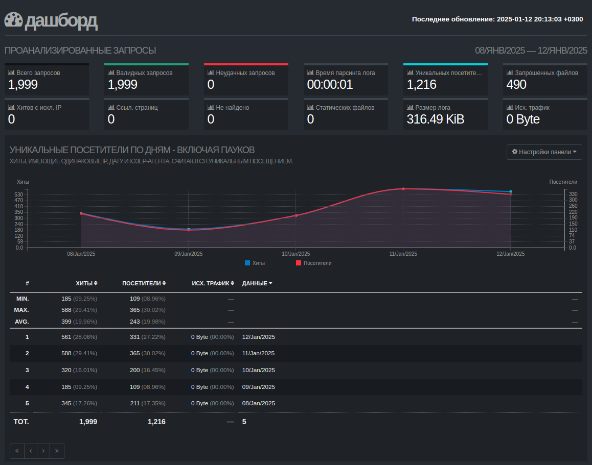
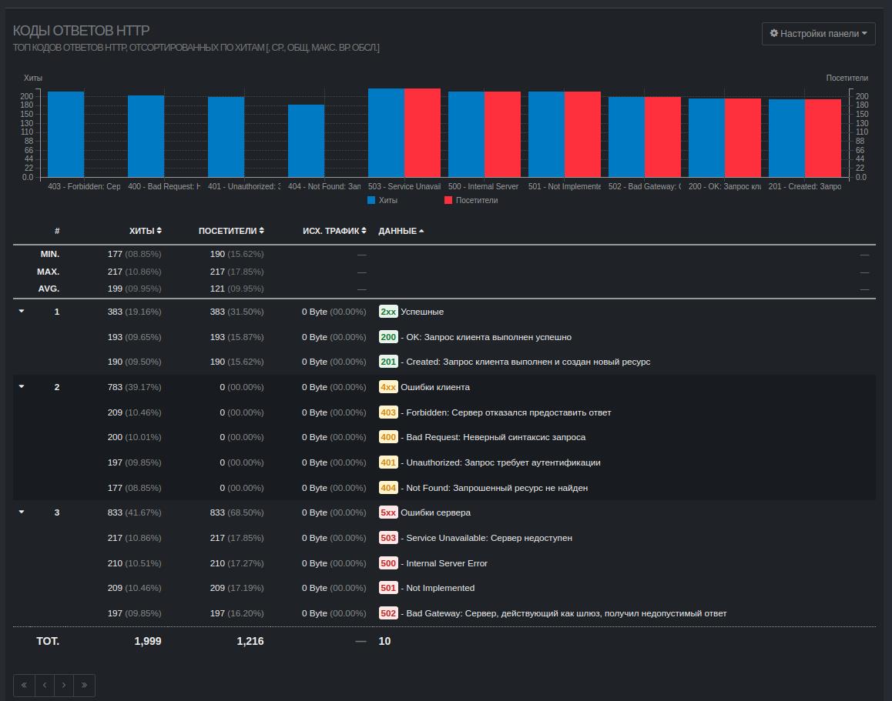
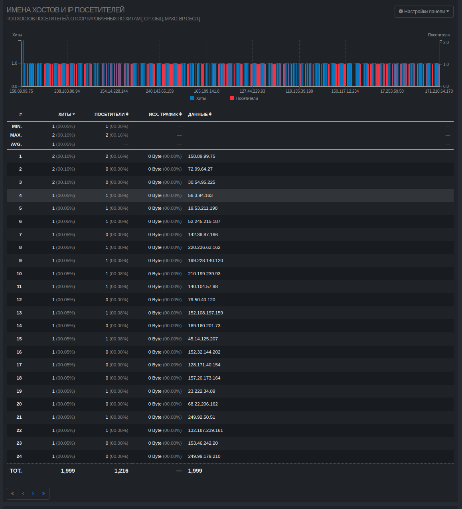
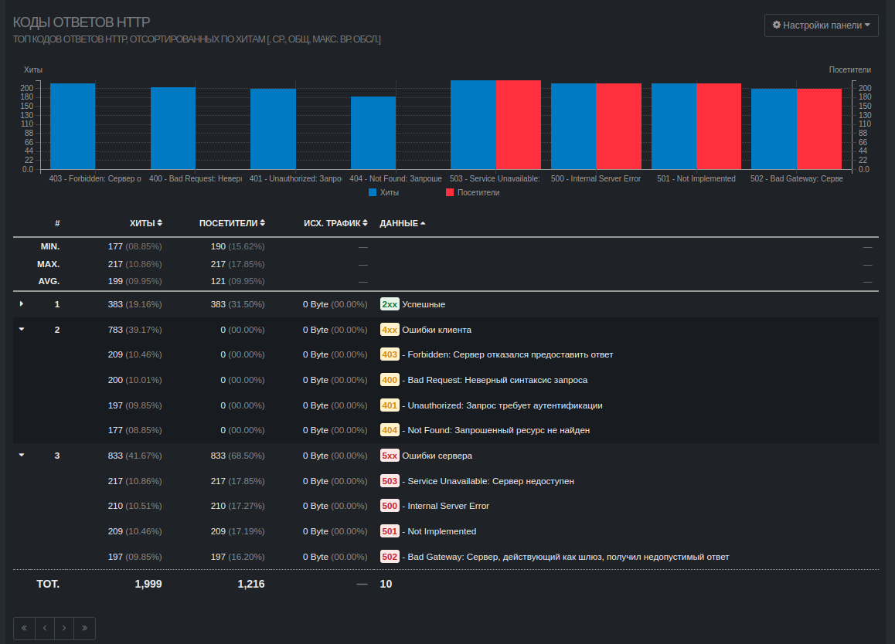

## Part 6. **GoAccess**


С помощью утилиты GoAccess получи ту же информацию, что и в [Части 5](#part-5-мониторинг).

Открой веб-интерфейс утилиты на локальной машине.

1. Установить goaccess:
```
sudo apt-get install goaccess
```
2. Сформировать html страницу и открыть ее:
```
goaccess ../04/*.log -o report.html --log-format=COMBINED
```



3. Отсортировать по кодам ответа:


4. Все уникальные IP, встречающиеся в записях:


5. Все запросы с ошибками (код ответа - 4хх или 5хх).

