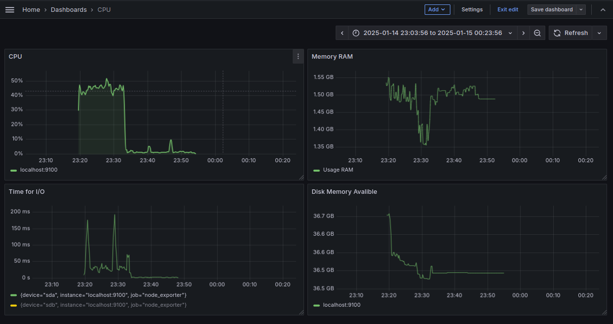

## Part 7. **Prometheus** и **Grafana**


* Установи и настрой **Prometheus** и **Grafana** на виртуальную машину.

*  Получи доступ к веб-интерфейсам **Prometheus** и **Grafana** с локальной машины.
    * Prometheus<br>

    * Grafana<br>

* Добавь на дашборд **Grafana** отображение ЦПУ, доступной оперативной памяти, свободное место и кол-во операций ввода/вывода на жестком диске.<br>

* Запусти свой bash-скрипт из Части 2
```
./main.sh az az.az 30Mb
```
* Посмотри на нагрузку жесткого диска (место на диске и операции чтения/записи).

    * Место на диске<br>
    

    * Операции чтения/записи<br>
    

* Установи утилиту **stress** и запусти команду
```
stress -c 2 -i 1 -m 1 --vm-bytes 32M -t 10s
```
* Посмотри на нагрузку жесткого диска, оперативной памяти и ЦПУ.
    
    * ЦПУ<br>
        
    
    * Оперативная память<br>
         

    * Операции чтения/записи<br>
         
    
    * Место на диске<br>
                