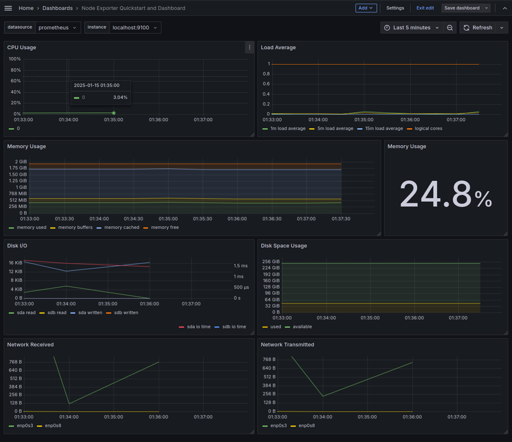
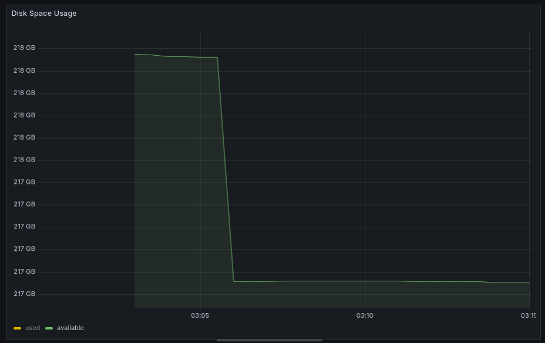
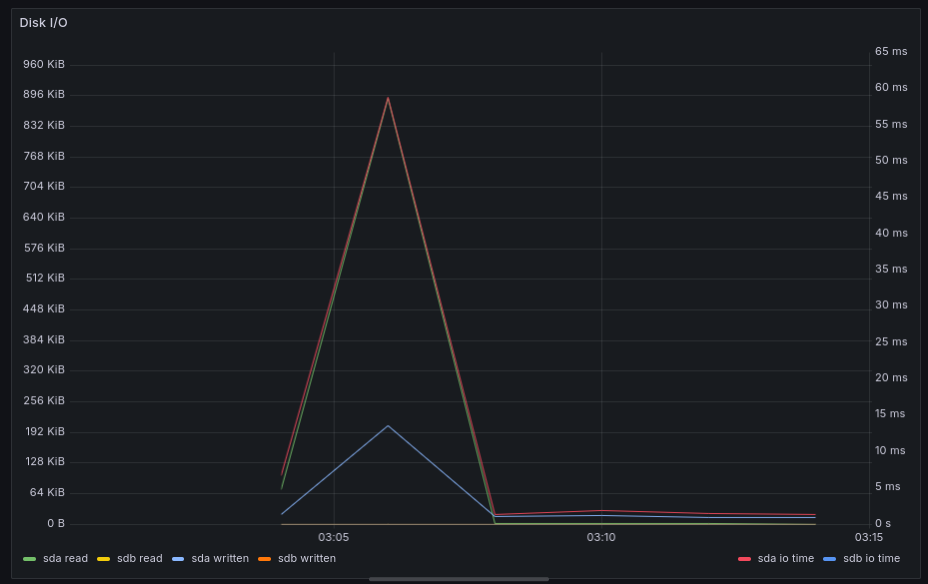
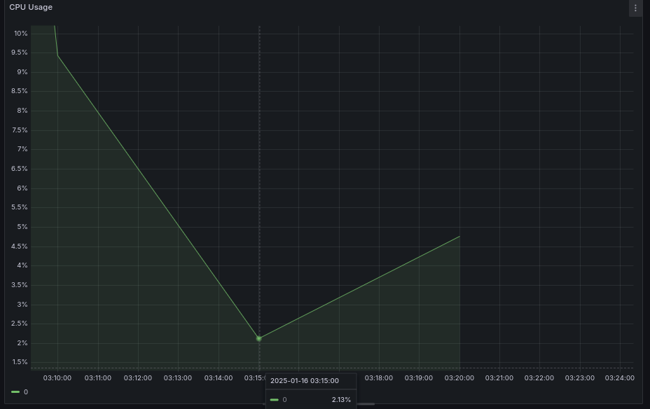
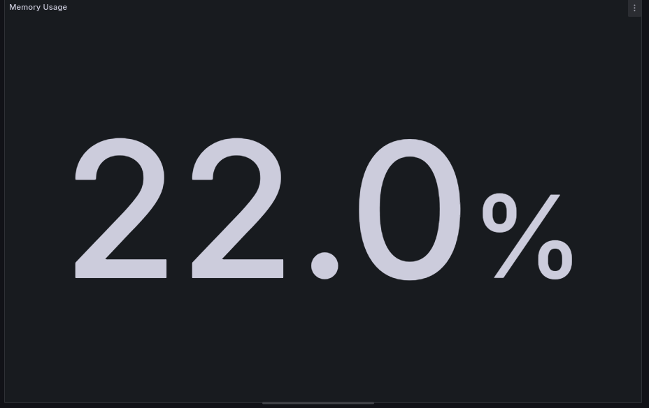
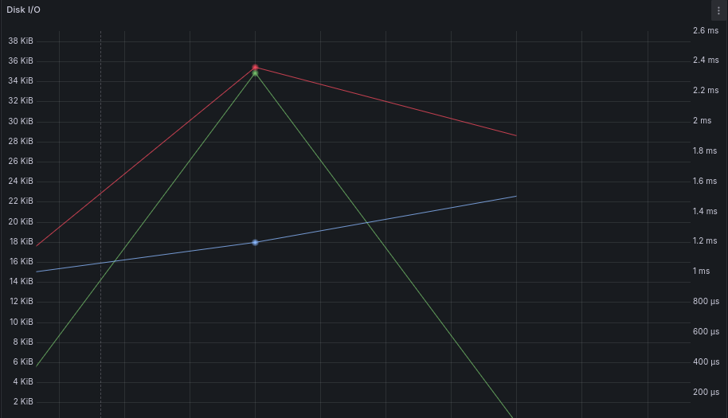
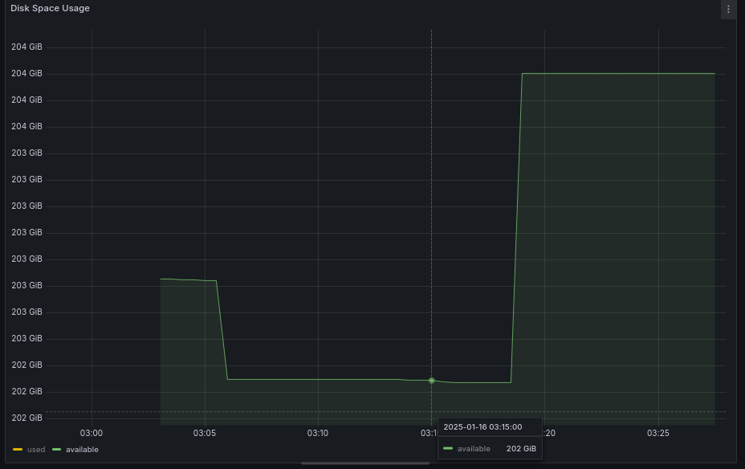
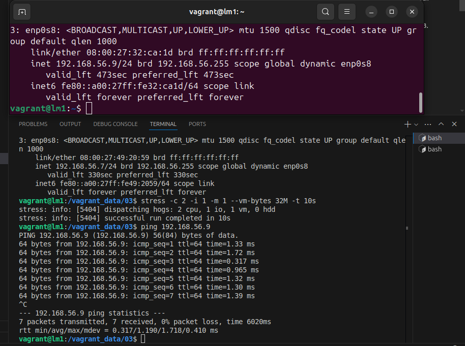
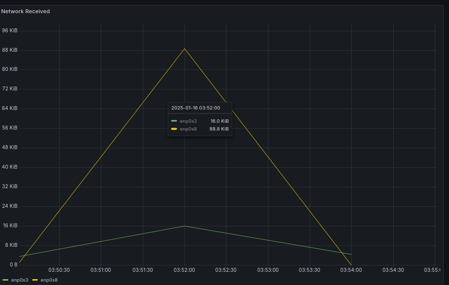
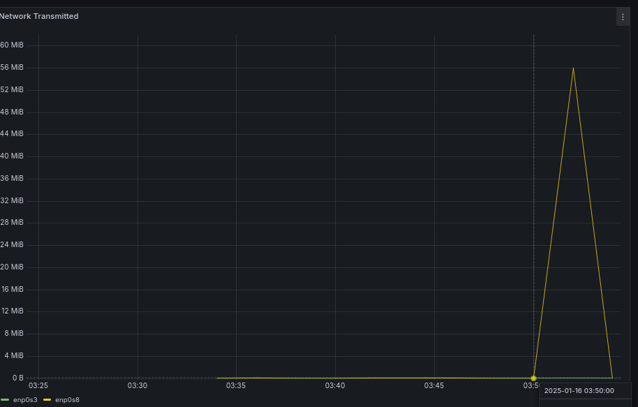

## Part 8. Готовый дашборд

##### Установи готовый дашборд *Node Exporter Quickstart and Dashboard* с официального сайта **Grafana Labs**.


##### Проведи те же тесты, что и в [Части 7](#part-7-prometheus-и-grafana).

* Запусти свой bash-скрипт из Части 2
```
./main.sh az az.az 30Mb
```
* Посмотри на нагрузку жесткого диска (место на диске и операции чтения/записи).

    * Место на диске<br>
    

    * Операции чтения/записи<br>
    

* Установи утилиту **stress** и запусти команду
```
stress -c 2 -i 1 -m 1 --vm-bytes 32M -t 10s
```
* Посмотри на нагрузку жесткого диска, оперативной памяти и ЦПУ.
    
    * ЦПУ<br>
        
    
    * Оперативная память<br>
         

    * Операции чтения/записи<br>
         
    
    * Место на диске<br>
               

##### Запусти ещё одну виртуальную машину, находящуюся в одной сети с текущей.
   
##### Запусти тест нагрузки сети с помощью утилиты **iperf3**.
 * Устанавотите на машинах утилиту
```
sudo apt-get update
sudo apt-get install iperf3

```

* Запустите на одной машине сервер:
```
iperf3 -s
```

* На другой машине выполните тест в течение 30 секунд, используя 8 параллельных потоков и выводя статистику каждые 5 секунд:
```
iperf3 -c 192.168.56.9 -P 8 -t 30 -i 5
```

##### Посмотри на нагрузку сетевого интерфейса.

* Прием пакетов<br>
 

* Отправка пакетов<br>
  