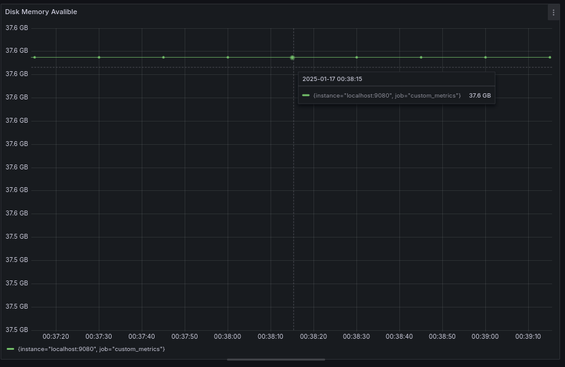

Напиши bash-скрипт или программу на С, собирающие информацию по базовым метрикам системы (ЦПУ, оперативная память, жесткий диск (объем)).
Скрипт или программа должна формировать html страничку по формату **Prometheus**, которую будет отдавать **nginx**. \
Саму страничку обновлять можно как внутри bash-скрипта или программы (в цикле), так и при помощи утилиты cron, но не чаще, чем раз в 3 секунды.

* устанавливаем nginx<br>
```
sudo apt update
sudo apt install nginx
```

* меняем конфигурацию nginx и перезапускаем<br>


* пишем скрипт для сбора метрик и сохраняем их в файл html. Запускаем скрипт

* меняем конфигурацию prometheus и перезапускаем<br>


* проверяем работает ли страница с метриками<br>


##### Поменяй конфигурацию **Prometheus**, чтобы он собирал информацию с созданной тобой странички.
* проверяем видит ли prometheus наши метрики<br>


* настраиваем дашборд<br>


##### Проведи те же тесты, что и в [Части 7](#part-7-prometheus-и-grafana).

* Запусти свой bash-скрипт из Части 2
```
./main.sh az az.az 30Mb
```
* Посмотри на нагрузку жесткого диска (место на диске).

    * Место на диске<br>
    


* Установи утилиту **stress** и запусти команду
```
stress -c 2 -i 1 -m 1 --vm-bytes 32M -t 10s
```
* Посмотри на нагрузку жесткого диска, оперативной памяти и ЦПУ.
    
    * ЦПУ<br>
        
    
    * Оперативная память<br>
         
    
    * Место на диске<br>
         